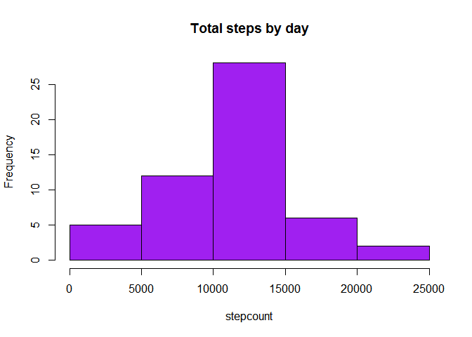
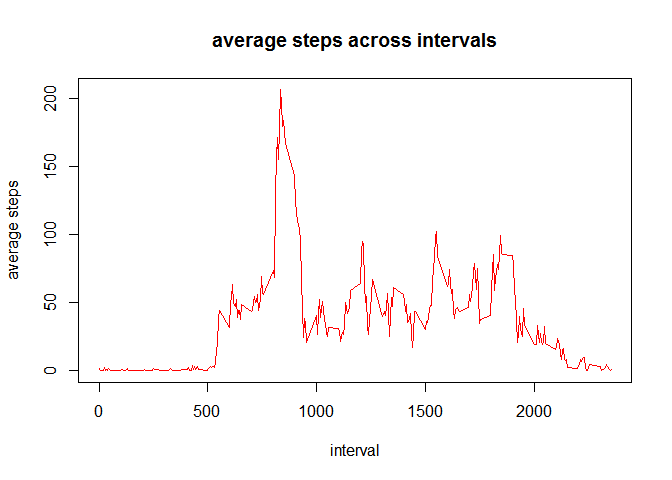
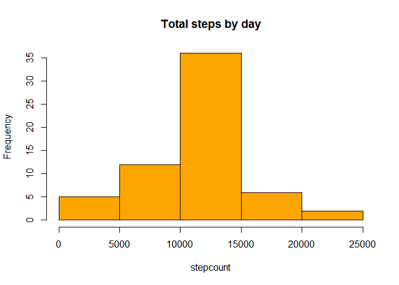
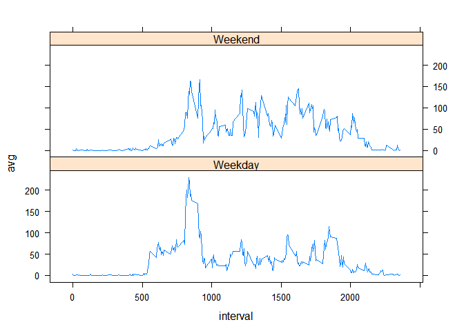

# Reproducible Research: Peer Assessment 1

This is an R Markdown file

This is code to that reads and process the data into a data table.
It also parses and cleans the data

```r
library(data.table)
```

```
## Warning: package 'data.table' was built under R version 3.2.5
```

```r
setwd("C:/Users/phyland/Desktop/RWorkingDirectory/RepData_PeerAssessment1")
activity <- fread("activity.csv", na.strings = "NA")
table(is.na(activity$steps))
```

```
## 
## FALSE  TRUE 
## 15264  2304
```
Assigns the columns as date, then appends a new column with day of week

```r
activity$date <- as.Date(activity$date,"%Y-%m-%d")
activity$dow <- weekdays(activity$date)
```
Checks the frequency of NAs

```r
table(is.na(activity$steps))
```

```
## 
## FALSE  TRUE 
## 15264  2304
```
Uses a sql package to get sum of steps by date and plots in histogram

```r
library(sqldf)
```

```
## Warning: package 'sqldf' was built under R version 3.2.5
```

```
## Loading required package: gsubfn
```

```
## Warning: package 'gsubfn' was built under R version 3.2.5
```

```
## Loading required package: proto
```

```
## Warning: package 'proto' was built under R version 3.2.5
```

```
## Loading required package: RSQLite
```

```
## Warning: package 'RSQLite' was built under R version 3.2.5
```

```r
totperday2 <- sqldf("SELECT sum(steps) as tot,date FROM activity GROUP BY date")
```

```
## Loading required package: tcltk
```

```
## Warning: Quoted identifiers should have class SQL, use DBI::SQL() if the
## caller performs the quoting.
```

```r
hist(totperday2$tot, xlab= "stepcount", main="Total steps by day", col="purple")
```

<!-- -->
Mean and median number of steps taken each day

```r
mean(totperday2$tot,na.rm=T)
```

```
## [1] 10766.19
```

```r
median(totperday2$tot,na.rm=T)
```

```
## [1] 10765
```
uses sql package again to get average steps by interval and plots in histogram

```r
avgperint <- sqldf("SELECT avg(steps) as avg, interval FROM activity GROUP BY interval")

with(avgperint,plot(avgperint$interval,avgperint$avg,type="l", col = "red",
                    xlab= "interval", ylab="average steps",main= "average steps across intervals"))
```

<!-- -->
Finds max value and returns its corresponding interval

```r
maxint <- avgperint[avgperint$avg == max(avgperint$avg),2]
maxint
```

```
## [1] 835
```
This first checks to see how many NAs, copies the data table, then imputes.  
Imputing is done through a loop which first determines if there is a NA value.  
If so, it imputes the average steps for its corresponding interval into the new data frame.

```r
sum(is.na(activity$steps))
```

```
## [1] 2304
```

```r
newactivity <- activity

for (i in 1:length(activity$steps)) {
 
  if (is.na(activity$steps[i])) {
    newactivity$steps[i] <- avgperint$avg[avgperint$interval == activity$interval[i]]
  }
}
```
New sql statement and Histogram of the total number of steps taken each day,
after missing values are imputed

```r
totperday3 <- sqldf("SELECT sum(steps) as tot,date FROM newactivity GROUP BY date")
hist(totperday3$tot,xlab= "stepcount", main="Total steps by day", col="orange")
```

<!-- -->
Mean and median then recalculated

```r
mean(totperday3$tot)
```

```
## [1] 10766.19
```

```r
median(totperday3$tot)
```

```
## [1] 10766.19
```
Code that re-creates the day of week, and factors on whether it's a weekend or weekday.

```r
newactivity$dow <- weekdays(newactivity$date)

typeofday <- as.factor(c('Weekend','Weekday'))

newactivity$type<- NA
for (i in 1:length(newactivity$type)) {
  if(newactivity$dow[i] %in% c('Saturday','Sunday')) {
    newactivity$type[i] <- "Weekend"
} else {
  newactivity$type[i] <- "Weekday"
}
}  
```
sql statement to make average number of steps by interval and type, then plotted using lattice

```r
library(lattice)
```

```
## Warning: package 'lattice' was built under R version 3.2.5
```

```r
library(sqldf)
newsql <- sqldf("SELECT avg(steps) as avg, interval,type FROM newactivity GROUP BY  interval,type")

xyplot(avg ~ interval | type, data = newsql, layout = c(1,2),type="l")
```

<!-- -->
